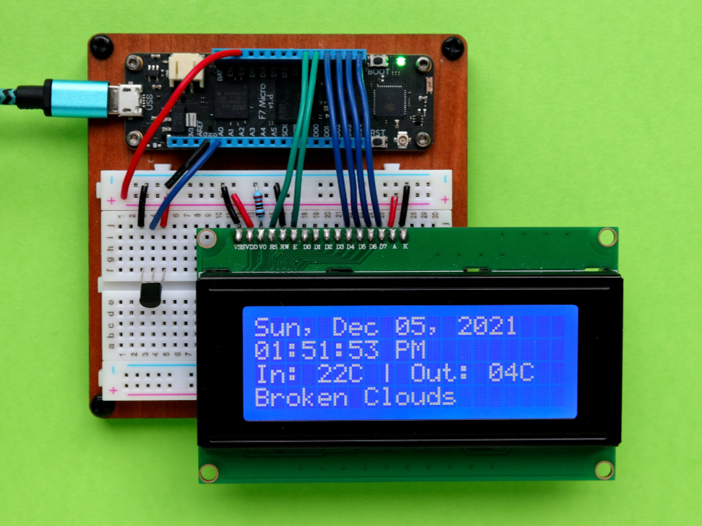
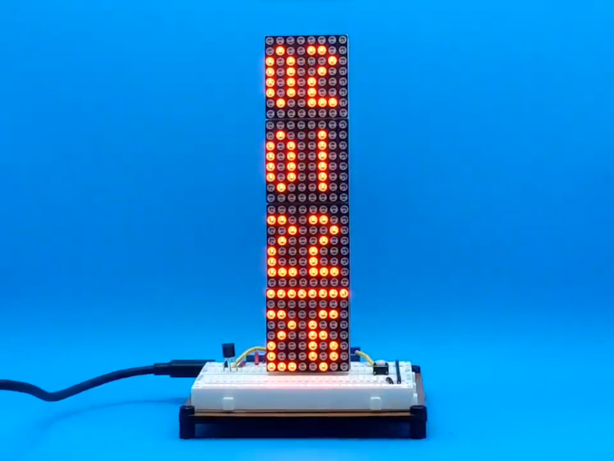
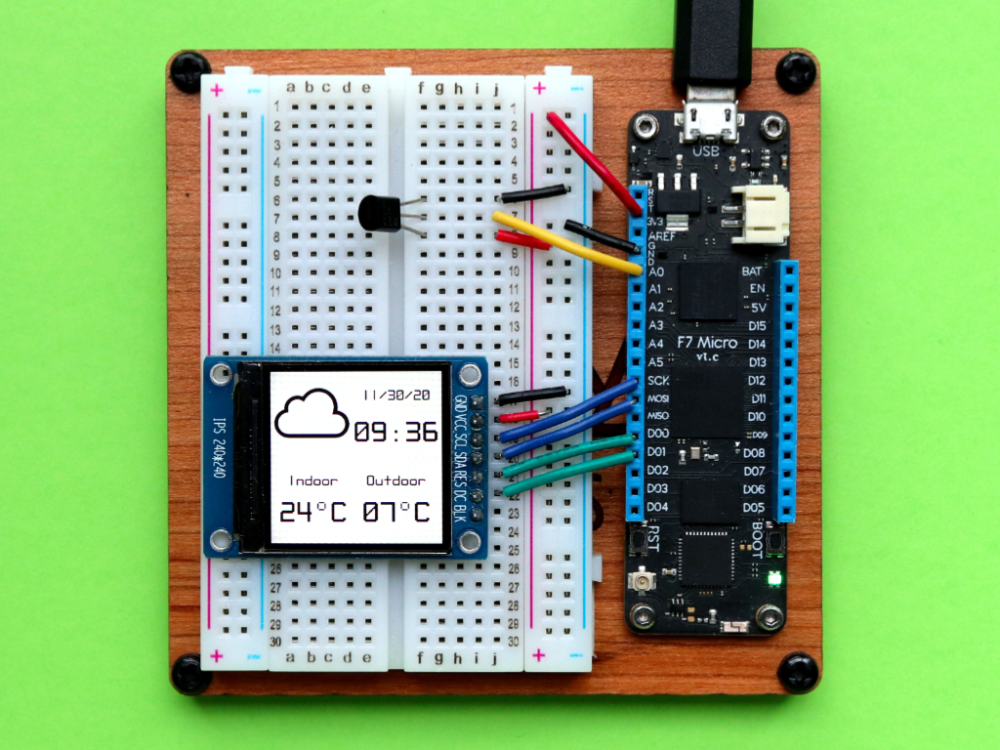

Public project samples for Meadow and Meadow.Foundation. Click on any of the projects below to go to the Hackster projects and learn how to build them.

<table>    
<tr>
<td>
<br/>
Make a Meadow indoor/outdoor temperature/weather desk clock<br/>
<a href="https://www.hackster.io/wilderness-labs/make-a-meadow-indoor-outdoor-temperature-weather-desk-clock-463839">Hackster</a> | <a href="Source/Hackster/WifiWeatherClock/">Project</a>
</td>        
<td>
<br/>
Weather Station Using Public Web Service Using Meadow<br/>
<a href="https://www.hackster.io/wilderness-labs/build-a-wifi-connected-clock-using-meadow-e0c6b6">Hackster</a> | <a href="Source/Hackster/WifiClock/">Project</a>
</td>
<td>
<br/>
Build a WIFI Connected Clock Using Meadow<br/>
<a href="https://www.hackster.io/wilderness-labs/weather-station-using-public-web-service-using-meadow-e47765">Hackster</a> | <a href="Source/Hackster/WifiWeather/">Project</a>
</td>
</tr>
</table>

<table>
<tr>
<th align="center">

<p> 
<small>
EXAMPLE TEXT
</small>
</p>
</th>
<th align="center">

<p> 
<small>
EXAMPLE TEXT
</small>
</p>
</th>
</tr>
<tr>
<td>
<!-- REMOVE THE BACKSLASHES -->
\```jsonc
{
  "foo": [
    {
      "bar": "hello world"
    }
  ]
}
\```
  
</td>
<td>
<!-- REMOVE THE BACKSLASHES -->
\```jsonc
{
  "foo": [
    {
      "bar": "hello world"
    }
  ]
}
\```
  
</td>
</tr>
<tr>
<td align="center">
Column 1
</td>
<td align="center">
Column 2
</td>
</tr>
</table>

# Presentations

[DevCamp 2020](source/DevCamp%202020/)

[Developer Day 2021](sources/DeveloperDat2021/)

[Developer South Coast 2022](sources/DeveloperSouthCoast/)
