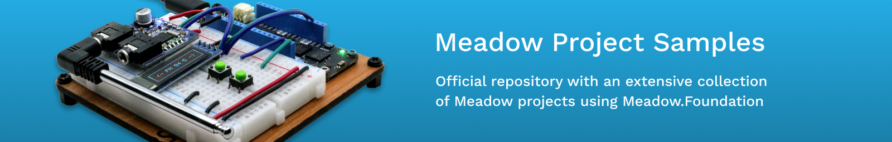
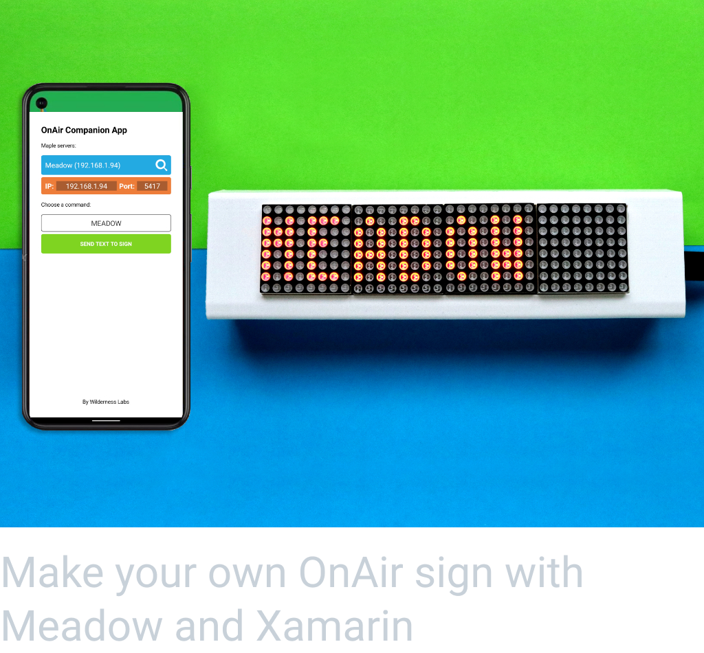
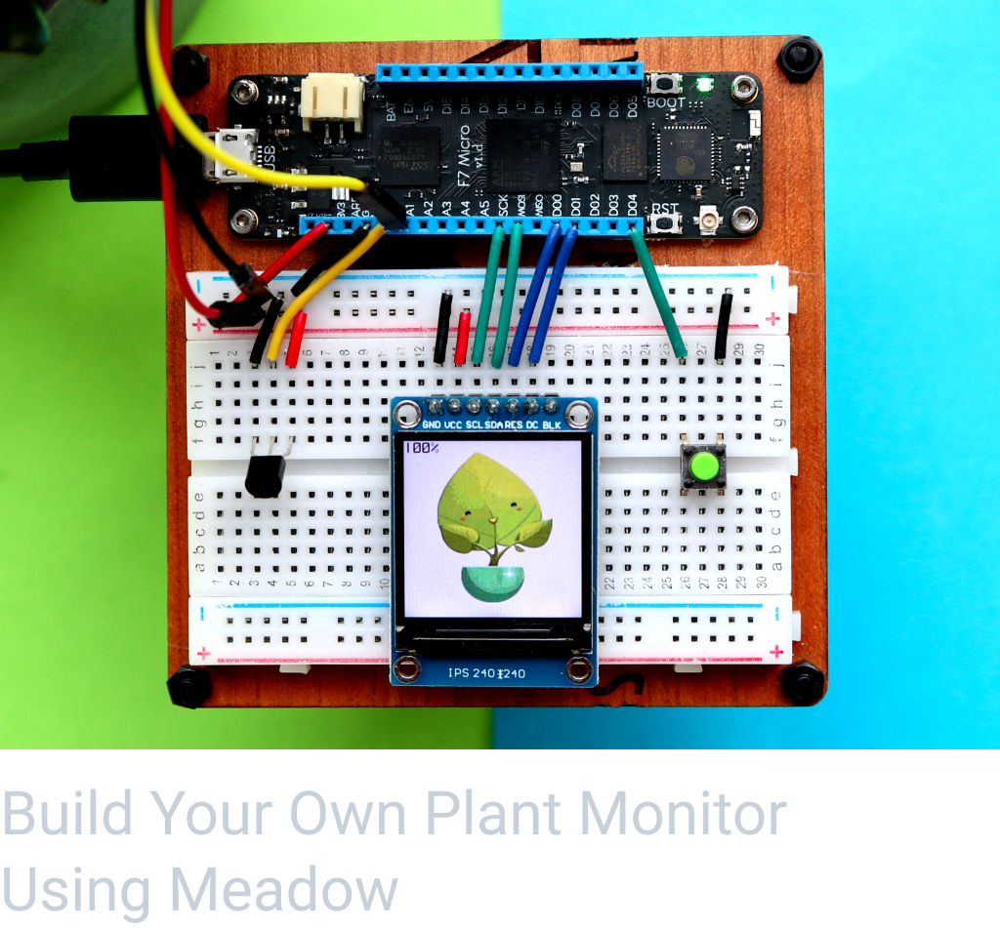
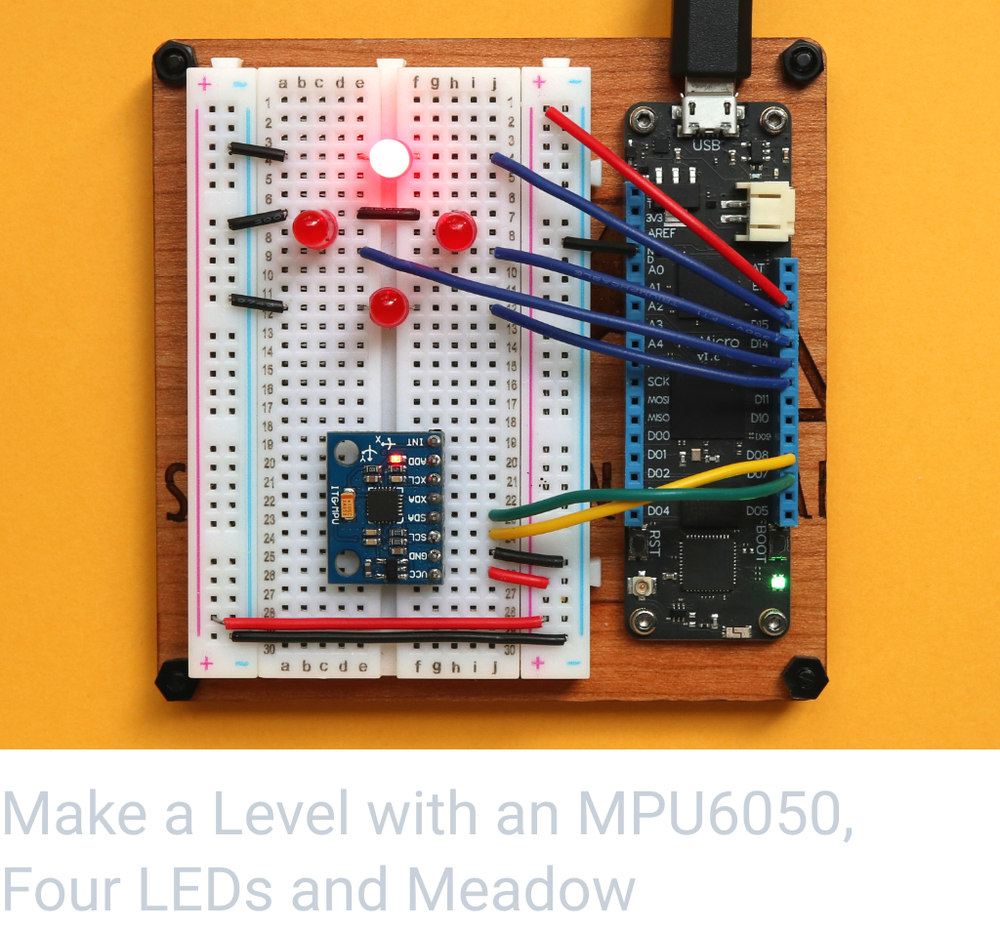

Public project samples for Meadow and Meadow.Foundation. Click on any of the projects below to go to the Hackster projects and learn how to build them.

<table>
    <tr>
        <td>
             
            Make your own OnAir sign with Meadow and Xamarin 
            <a href="https://www.hackster.io/wilderness-labs/make-your-own-onair-sign-with-meadow-and-xamarin-ea0c9e">Hackster</a> | <a href="https://github.com/WildernessLabs/OnAir_Sign">Source Code</a>
        </td>
        <td>
             
            Meadow Rover Part 2: Remote Control over Bluetooth 
            <a href="https://www.hackster.io/wilderness-labs/meadow-rover-part-2-remote-control-over-bluetooth-fe43f5">Hackster</a> | <a href="Source/Hackster/Rover/">Source Code</a>
        </td>
        <td>
             
            Build Your Own Plant Monitor Using Meadow 
            <a href="https://www.hackster.io/wilderness-labs/build-your-own-plant-monitor-using-meadow-5a4b6c">Hackster</a> | <a href="Source/Hackster/PlantMonitor/">Source Code</a>
        </td>
    </tr>
    <tr>
        <td>
             
            Control a RGB LED with Meadow and MAUI using Bluetooth 
            <a href="https://www.hackster.io/wilderness-labs/control-an-rgb-led-via-bluetooth-with-meadow-and-xamarin-9b2af3">Hackster</a> | <a href="Source/Hackster/Bluetooth/MeadowBleLed/">Source Code</a>
        </td>
        <td>
             
            Control a Servo with Meadow and MAUI using Bluetooth 
            <a href="https://www.hackster.io/wildernesslabs/control-a-servo-via-bluetooth-with-meadow-and-xamarin-57940a">Hackster</a> | <a href="Source/Hackster/Bluetooth/MeadowBleServo/">Source Code</a>
        </td>
        <td>
         
            Get temperature with Meadow and MAUI using Bluetooth 
            <a href="https://www.hackster.io/wilderness-labs/get-temperature-data-via-bluetooth-with-meadow-and-maui-app-397fb8">Hackster</a> | <a href="Source/Hackster/Bluetooth/MeadowBleTemperature/">Source Code</a>
            <!-- 
            Make a Level with an MPU6050, Four LEDs and Meadow 
            <a href="https://www.hackster.io/wilderness-labs/make-a-basic-level-with-an-mpu6050-four-leds-and-meadow-53a883">Hackster</a> | <a href="Source/Hackster/RotationDetector/">Source Code</a>-->
        </td>
    </tr>
    <tr>
        <td>
             
            Control a RGB LED with Meadow and MAUI using REST 
            <a href="https://www.hackster.io/wilderness-labs/remotely-control-an-rgb-led-with-meadow-and-xamarin-w-rest-153a28">Hackster</a> | <a href="Source/Hackster/Maple/MeadowMapleLed/">Source Code</a>
        </td>
        <td>
             
            Control a Servo with Meadow and MAUI using REST 
            <a href="https://www.hackster.io/wilderness-labs/remote-control-a-servo-with-meadow-and-xamarin-using-rest-063cb0">Hackster</a> | <a href="Source/Hackster/Maple/MeadowMapleServo/">Source Code</a>
        </td>
        <td>
         
            Get temperature logs with Meadow and MAUI using REST 
            <a href="https://www.hackster.io/wilderness-labs/get-temperature-logs-with-meadow-and-maui-using-rest-e529df">Hackster</a> | <a href="Source/Hackster/Maple/MeadowMapleTemperature/">Source Code</a>
            <!-- 
            Train your Morse Code spelling skills with Meadow 
            <a href="https://www.hackster.io/wilderness-labs/train-your-morse-code-spelling-skills-with-meadow-3f2d9e">Hackster</a> | <a href="Source/Hackster/MorseCodeTrainer/">Source Code</a>-->
        </td>
    </tr>
    <tr>
        <td>
             
            Weather Station Using Public Web Service Using Meadow 
            <a href="https://www.hackster.io/wilderness-labs/weather-station-using-public-web-service-using-meadow-e47765">Hackster</a> | <a href="Source/Hackster/WifiWeather/">Source Code</a>
        </td>
        <td>
             
            Working with Graphics on a ST7789 Display Using Meadow 
            <a href="https://www.hackster.io/wilderness-labs/working-with-graphics-on-a-st7789-display-using-meadow-e2295a">Hackster</a> | <a href="Source/Hackster/MeadowClockGraphics/">Source Code</a>
        </td>
        <td>
             
            Make an Image Gallery with an ST7789 Display and Meadow 
            <a href="https://www.hackster.io/wilderness-labs/make-an-image-gallery-with-an-st7789-display-and-meadow-a80f5c">Hackster</a> | <a href="Source/Hackster/GalleryViewer/">Source Code</a>
        </td>
    </tr>
    <tr>
        <td>
             
            Make an indoor/outdoor temperature/weather desk clock 
            <a href="https://www.hackster.io/wilderness-labs/make-a-meadow-indoor-outdoor-temperature-weather-desk-clock-463839">Hackster</a> | <a href="Source/Hackster/WifiWeatherClock/">Source Code</a>
        </td>
        <td>
             
            Build a WIFI Connected Clock Using Meadow 
            <a href="https://www.hackster.io/wilderness-labs/build-a-wifi-connected-clock-using-meadow-e0c6b6">Hackster</a> | <a href="Source/Hackster/WifiClock/">Source Code</a>
        </td>
        <td>
             
            Control a Servo with a Push Button Using Meadow 
            <a href="https://www.hackster.io/wilderness-labs/control-a-servo-with-a-push-button-using-meadow-c6c996">Hackster</a> | <a href="Source/Hackster/ServoButton/">Source Code</a>
        </td>
    </tr>
    <tr>
        <td>
             
            Build Your a Temperature Monitor with Meadow 
            <a href="https://www.hackster.io/wilderness-labs/build-your-own-temperature-monitor-with-meadow-edc696">Hackster</a> | <a href="Source/Hackster/TemperatureMonitor">Source Code</a>
        </td>
        <td>
             
            Control a LedBar using a Rotary Encoder with Meadow 
            <a href="https://www.hackster.io/wilderness-labs/control-a-ledbar-using-a-rotary-encoder-with-meadow-30efeb">Hackster</a> | <a href="Source/Hackster/RotaryLedBar/">Source Code</a>
        </td>
        <td>
             
            Build Your Own Simon Game with Meadow 
            <a href="https://www.hackster.io/wilderness-labs/build-your-own-simon-game-with-meadow-3701d5">Hackster</a> | <a href="Source/Hackster/Simon/">Source Code</a>
        </td>
    </tr>
    <tr>
        <td>
             
            Expanding IO Ports on Meadow with an MCP23008 
            <a href="https://www.hackster.io/wilderness-labs/expanding-io-ports-on-meadow-with-an-mcp23008-23a512">Hackster</a> | <a href="Source/Hackster/McpLeds/">Source Code</a>
        </td>
        <td>
             
            Build Smart Holiday Lights with RGB LED Strips 
            <a href="https://www.hackster.io/wilderness-labs/build-smart-holiday-lights-with-rgb-led-strips-using-meadow-1b0f53">Hackster</a> | <a href="Source/Hackster/MerryXmasLights/">Source Code</a>
        </td>
        <td>
             
            Expanding IO Ports of a Meadow with a 74HC595 
            <a href="https://www.hackster.io/wilderness-labs/expanding-io-ports-of-a-meadow-with-a-74hc595-dde681">Hackster</a> | <a href="Source/Hackster/ShiftRegisterLeds/">Source Code</a>
        </td>
    </tr>
    <tr>
        <td>
             
            Build an FM Radio Player Using Meadow 
            <a href="https://www.hackster.io/wilderness-labs/build-an-fm-radio-player-with-meadow-8c0a63">Hackster</a> | <a href="Source/Hackster/RadioPlayer/">Source Code</a>
        </td>
        <td>
             
            Control a Servo with a Rotary Encoder Using Meadow 
            <a href="https://www.hackster.io/wilderness-labs/control-a-servo-with-a-rotary-encoder-using-meadow-47c003">Hackster</a> | <a href="Source/Hackster/RotaryServo/">Source Code</a>
        </td>
        <td>
             
            Build an Interactive Menu with TextDisplayMenu 
            <a href="https://www.hackster.io/wilderness-labs/build-an-interactive-menu-with-textdisplaymenu-using-meadow-218884">Hackster</a> | <a href="Source/Hackster/MeadowMenu/">Source Code</a>
        </td>
    </tr>
    <tr>
        <td>
             
            Meadow Rover Part 1: Motor Control with directional LEDs 
            <a href="https://www.hackster.io/wilderness-labs/meadow-rover-part-1-motor-control-with-directional-leds-85107d">Hackster</a> | <a href="Source/Hackster/Rover/RoverLed">Source Code</a>
        </td>
        <td>
             
            Build an Obstacle Radar with a distance sensor and MicroGraphics 
            <a href="https://www.hackster.io/wilderness-labs/build-an-obstacle-radar-with-meadow-d9bf2e">Hackster</a> | <a href="Source/Hackster/ObstacleRadar/">Source Code</a>
        </td>
        <td>
             
            Build a Clock with Meadow's Onboard Real Time Clock Chip 
            <a href="https://www.hackster.io/wilderness-labs/build-a-clock-with-meadow-s-onboard-real-time-clock-chip-2b1f85">Hackster</a> | <a href="Source/Hackster/MeadowClock/">Source Code</a>
        </td>
    </tr>
    <tr>
        <td>
             
            Working with a Touch Keypad and SPI Display 
            <a href="https://www.hackster.io/wilderness-labs/working-with-a-touch-keypad-and-spi-display-using-meadow-ddb040">Hackster</a> | <a href="Source/Hackster/TouchKeypad/">Source Code</a>
        </td>
        <td>
             
            WIFI Christmas Countdown Timer with a LCD 
            <a href="https://www.hackster.io/wilderness-labs/wifi-christmas-countdown-timer-w-an-lcd-display-and-meadow-e4cf9c">Hackster</a> | <a href="Source/Hackster/ChristmasCountdown/">Source Code</a>
        </td>
        <td>
             
            Using a 2-Axis Analog Joystick with Meadow 
            <a href="https://www.hackster.io/wilderness-labs/using-a-2-axis-analog-joystick-with-meadow-e3188e">Hackster</a> | <a href="Source/Hackster/LedJoystick/">Source Code</a>
        </td>
        <!--<td>
             
            <a href="https://www.hackster.io/wilderness-labs/wifi-christmas-countdown-timer-w-an-lcd-display-and-meadow-e4cf9c">Hackster</a> | 
    <a href="Source/Hackster/ChristmasCountdown/">Source Code</a>
        </td>-->
    </tr>
    <tr>
        <td>
            
&nbsp;&nbsp;&nbsp;&nbsp;&nbsp;&nbsp;&nbsp;&nbsp;&nbsp;&nbsp;&nbsp;&nbsp;&nbsp;&nbsp;&nbsp;&nbsp;&nbsp;&nbsp;&nbsp;&nbsp;&nbsp;&nbsp;&nbsp;&nbsp;&nbsp;&nbsp;&nbsp;&nbsp;&nbsp;&nbsp;&nbsp;&nbsp;

        </td>
        <td>
            
&nbsp;&nbsp;&nbsp;&nbsp;&nbsp;&nbsp;&nbsp;&nbsp;&nbsp;&nbsp;&nbsp;&nbsp;&nbsp;&nbsp;&nbsp;&nbsp;&nbsp;&nbsp;&nbsp;&nbsp;&nbsp;&nbsp;&nbsp;&nbsp;&nbsp;&nbsp;&nbsp;&nbsp;&nbsp;&nbsp;&nbsp;&nbsp;

        </td>
        <td>
            
&nbsp;&nbsp;&nbsp;&nbsp;&nbsp;&nbsp;&nbsp;&nbsp;&nbsp;&nbsp;&nbsp;&nbsp;&nbsp;&nbsp;&nbsp;&nbsp;&nbsp;&nbsp;&nbsp;&nbsp;&nbsp;&nbsp;&nbsp;&nbsp;&nbsp;&nbsp;&nbsp;&nbsp;&nbsp;&nbsp;&nbsp;&nbsp;

        </td>
    </tr>
</table>

# Presentations

[DevCamp 2020](source/DevCamp%202020/)

[Developer Day 2021](sources/DeveloperDat2021/)

[Developer South Coast 2022](sources/DeveloperSouthCoast/)
