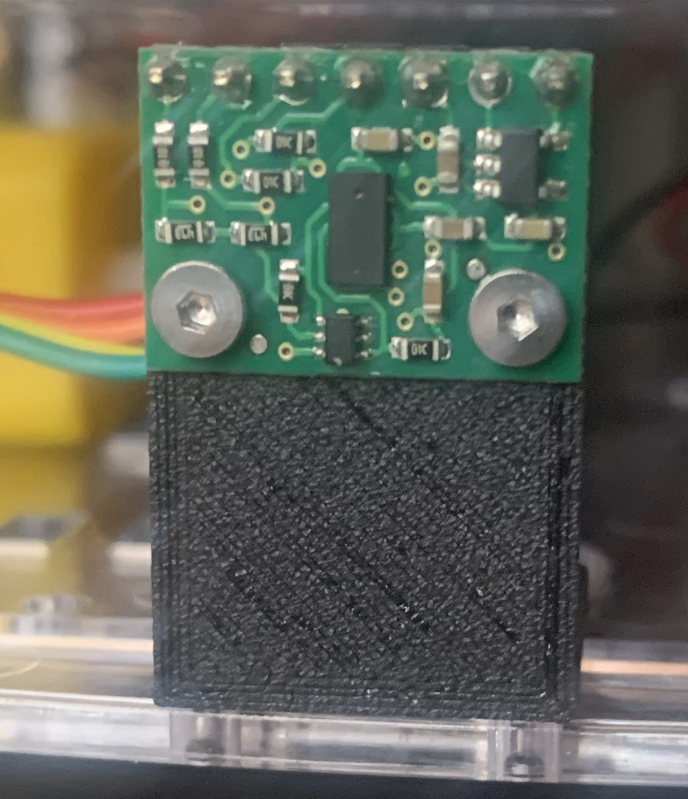

# Mars Rover

Rover project using the [EMOZNY Mecanum 4 wheel drive rover](https://www.amazon.co.uk/gp/product/B084TNLFYB/ref=ppx_yo_dt_b_asin_title_o01_s00?ie=UTF8&psc=1).  The rover is controlled using Bluetooth and also integrates the [VL53L0X distance sensor](https://coolcomponents.co.uk/products/vl53l0x-time-of-flight-distance-sensor-carrier-with-voltage-regulator-200cm-max?_pos=1&_sid=84ed08d55&_ss=r) for collision detection.

## Hardware

Collision detection is performed using the VL53L0X distance sensor.  The documentation for the sensor is available [here](http://developer.wildernesslabs.co/docs/api/Meadow.Foundation/Meadow.Foundation.Sensors.Distance.Vl53l0x.html).

Drive control is achieved using two SN754410 motor drivers.  Documentation is available [here](http://developer.wildernesslabs.co/docs/api/Meadow.Foundation/Meadow.Foundation.Motors.HBridgeMotor.html).